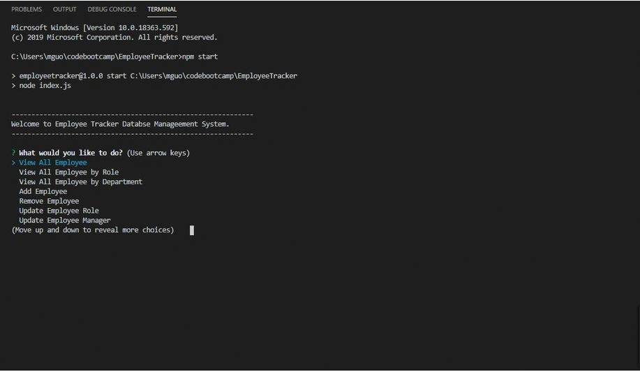

# Employee Tracker

## Badges


## License

Copyright 2020 - Max Guo. Code released under the MIT license.

## User Story
```
As a business owner
I want to be able to view and manage the departments, roles, and employees in my company
So that I can organize and plan my business
```
## Table of Content

* [Description](#Description)
* [Demo](#Demo)
* [Contributing](#Contributing)
* [Reference](#Reference)


## Description

Database Flow Diagram:


* **department**:

  * **id** - INT PRIMARY KEY
  * **name** - VARCHAR(30) to hold department name

* **role**:

  * **id** - INT PRIMARY KEY
  * **title** -  VARCHAR(30) to hold role title
  * **salary** -  DECIMAL to hold role salary
  * **department_id** -  INT to hold reference to department role belongs to

* **employee**:

  * **id** - INT PRIMARY KEY
  * **first_name** - VARCHAR(30) to hold employee first name
  * **last_name** - VARCHAR(30) to hold employee last name
  * **role_id** - INT to hold reference to role employee has
  * **manager_id** - INT to hold reference to another employee that manager of the current employee. This field may be null if the employee has no manager
  
The command-line applicationwill allows the user to:

 * View employees

  * View All Employee by Role

  * Update employee roles

  * View All Employee by Department

  * Add Employee

  * Remove Employee

  * Update Employee Role

  * Update Employee Manager

## Demo



## Contributing

Max, github:https://github.com/Maxguojiaq

## Reference
Mysql NPM: https://www.npmjs.com/package/mysql
inquirer NPM: https://www.npmjs.com/package/inquirer/v/0.2.3
console.table NPM: https://www.npmjs.com/package/console.table

